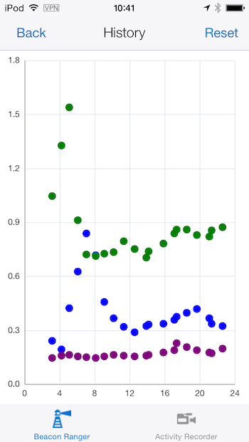

Beacon Monitor
==============

An example application showing how to monitor Estimote Beacons from Oracle Mobile Application Framework applications.

Gets a list of known regions (by UUID) from a RESTful service, running on Oracle APEX, and a list of known beacons in that region, and their attributes (like color and position for trilateration) and can show, amongst other things, the history of the distance to those beacons over time.

